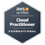
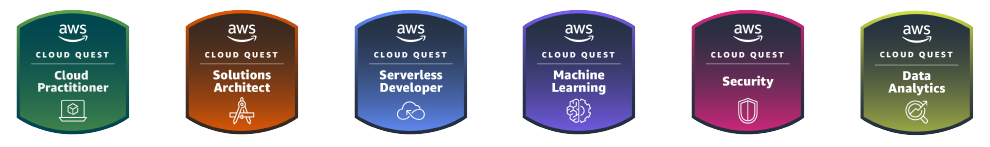
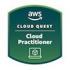
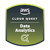

- [Site](https://alex-hedley.github.io/)
- [🎙️ Talks](https://alex-hedley.github.io/talks)

### Badges

## AWS

### Certified

- Cloud Practitioner (Foundational)
- WIP: ~~Developer (Associate)~~

### Cloud Quest

- Cloud Practitioner
- Serverless Developer
- Solutions Architect
- Data Analytics
- Machine Learning
- Security
- Networking

<!--  -->

## (ISC)²

- Candidate
- Certified in Cybersecurity℠ - CC
- WIP: ~~Certified Secure Software Lifecycle Professional - CSSLP~~

[² Candidate")](https://www.isc2.org/Membership)
[² CC")](https://www.isc2.org/Certifications/CC)

### 📢 Find me elsewhere

<!--  -->
<!-- ](https://app.pluralsight.com/profile/alex--hedley) -->

### 🚧 I build with...

