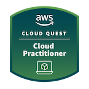
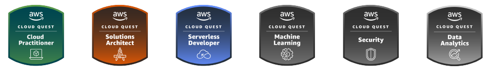

- [Site](https://alex-hedley.github.io/)
- [Blog](https://alex-hedley.github.io/blog)

### 📢 Find me elsewhere

  

### 🚧 I build with...

  

  

  

  

  

### Badges

- [Credly](https://www.credly.com/users/alexhedley/badges)

<!--  -->

<!--
### Hi there 👋

**alex-hedley/alex-hedley** is a ✨ _special_ ✨ repository because its `README.md` (this file) appears on your GitHub profile.

Here are some ideas to get you started:

- 🔭 I’m currently working on ...
- 🌱 I’m currently learning ...
- 👯 I’m looking to collaborate on ...
- 🤔 I’m looking for help with ...
- 💬 Ask me about ...
- 📫 How to reach me: ...
- 😄 Pronouns: ...
- ⚡ Fun fact: ...
-->
