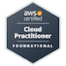
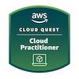
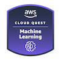
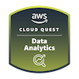

### Badges

## AWS

### Certified

- Cloud Practitioner (Foundational)
- WIP: ~~Developer (Associate)~~

### Cloud Quest

- Cloud Practitioner
- Serverless Developer
- Solutions Architect
- Data Analytics
- Machine Learning
- Security
- Networking

<!--  -->

## ISC2

<!-- [²-007054.svg?style=for-the-badge&logo=iscsquared&logoColor=white)](https://www.isc2.org/) -->

- Candidate
- Certified in Cybersecurity℠ - CC
- WIP: ~~Certified Secure Software Lifecycle Professional - CSSLP~~

# The Linux Foundation

- Green Software for Practitioners (LFC131)

### 📢 Find me elsewhere

<!--  -->
<!-- ](https://app.pluralsight.com/profile/alex--hedley) -->

### 🚧 I build with...

